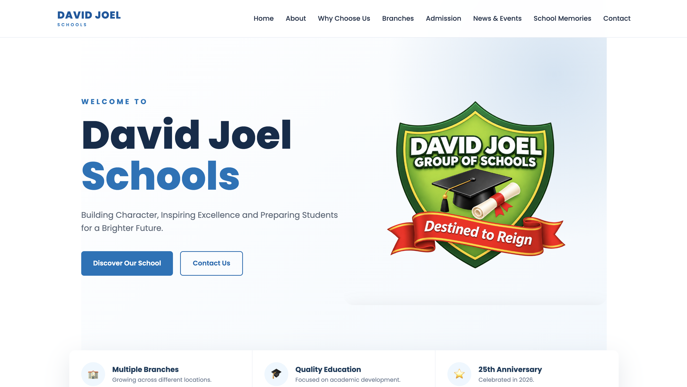
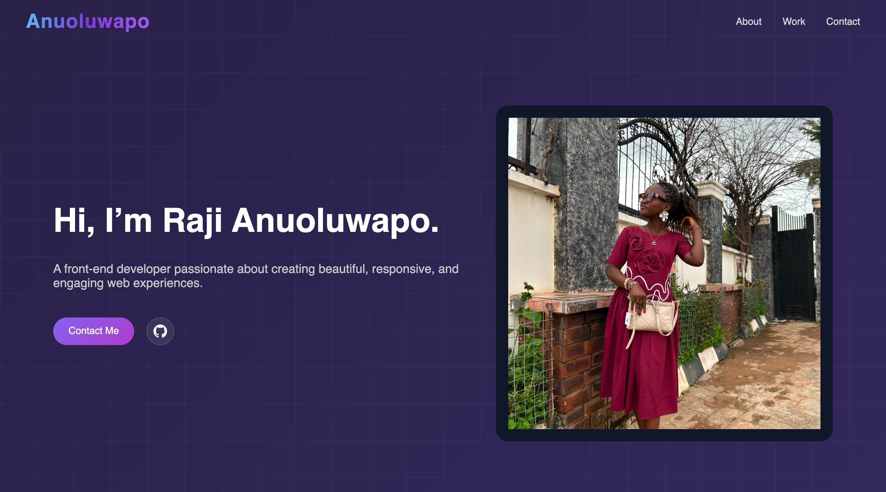
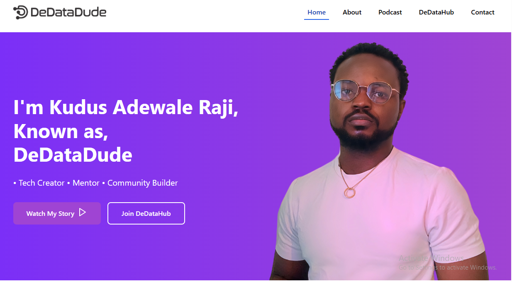
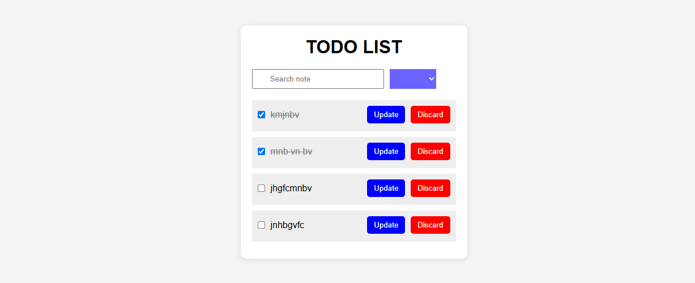
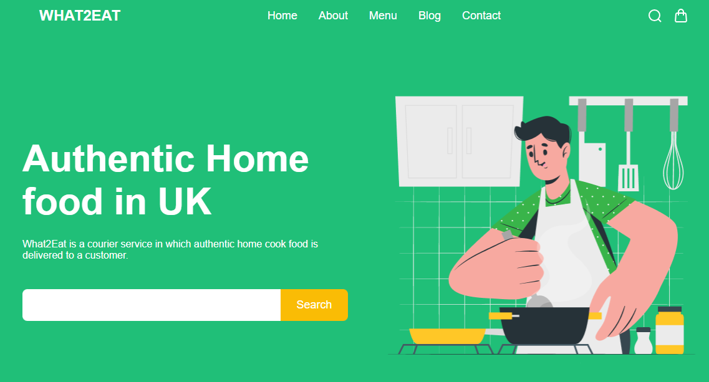

# Hi, I'm Raji Anuoluwapo Nifemi

### Front-End Developer | Aspiring AI Engineer

I'm a student and front-end developer passionate about building clean, responsive, and user-friendly digital experiences.

I enjoy turning ideas into functional websites and continuously improving my skills in web development and AI Engineering.

---

## Technologies & Skills

**Languages:** HTML, CSS, JavaScript

**Development:** Responsive Web Design, UI/UX

**Tools:** Git, GitHub, VS Code

---

## Featured Projects

### David Joel Schools

A responsive school website designed and developed for David Joel Schools, providing information about the school, its history, branches, events, media, and contact information.

**Built With:** HTML • CSS • JavaScript

[Live Website](https://davidjoelschools.com)

---

### My Portfolio

My personal developer portfolio showcasing my skills, projects, and journey as a front-end developer transitioning toward AI Engineering.

**Built With:** HTML • CSS • JavaScript

[Visit My Portfolio](https://mercyportfoliov2.netlify.app)

---

### DeDataDude

A web project focused on presenting data-related content through a clean and responsive user interface.

**Built With:** HTML • CSS • JavaScript

[Live Website](https://dedatadude.com)

---

### Todo List

A responsive task management application built to help users organize and manage their tasks.

**Built With:** HTML • CSS • JavaScript

[Live Website](https://mercytodolist.netlify.app) | [GitHub Repository](https://github.com/Anuoluwapo19-cpu/Todo-List)

---

### WHAT2EAT

A web application created to help users decide what to eat through a simple and interactive interface.

**Built With:** HTML • CSS • JavaScript

[Live Website](https://what4eat.netlify.app) | [GitHub Repository](https://github.com/Anuoluwapo19-cpu/WHAT2EAT)

---

## Currently Learning

* Advanced JavaScript
* Front-End Development
* AI Engineering
* Problem Solving
* Building real-world applications

---

## Let's Connect

I'm always open to connecting with other developers, creators, and people interested in technology.

[GitHub](https://github.com/Anuoluwapo19-cpu)
[Portfolio](https://mercyportfoliov2.netlify.app)
[TikTok](https://www.tiktok.com/@anuoluwapo.softwa)
---

Thanks for visiting my profile.
